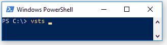
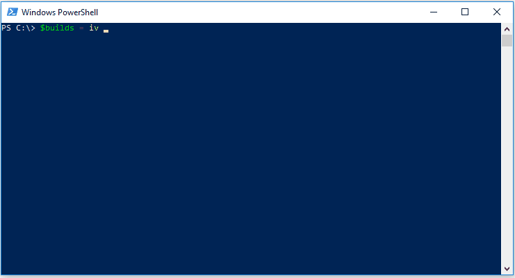

# posh-vsts-cli [](https://ci.appveyor.com/project/bergmeister/posh-vsts-cli/branch/master) [](https://ci.appveyor.com/project/bergmeister/posh-vsts-cli/build/tests) [](https://codecov.io/gh/bergmeister/posh-vsts-cli) [](http://google.com) [](https://www.gnu.org/licenses/gpl-3.0)

A `PowerShell` helper that enhances the [vsts-cli](https://github.com/Microsoft/vsts-cli) with

- Tab completion
- Conversion of the JSON or table output to a PowerShell object by providing the `Convert-FromVstsCli` command
- Wrapping the call to the `vsts` command and the object conversion in the `iv` command alias
- Installing the `vsts-cli`




## Installation

Install it from the [PSGallery](https://www.powershellgallery.com/packages/posh-vsts-cli/1.0):

````powershell
if ($PSVersionTable.PSVersion.Major -ge 5) {
    Install-Module posh-vsts-cli -Force
}
else {
    Install-Module TabExpansionPlusPlus -Force
    Install-Module posh-vsts-cli -Force
}
Import-Module posh-vsts-cli
````

If you have not already installed the `vsts-cli`, then you can use the following function of `posh-vsts-cli`, which uses the official installer from [here](https://aka.ms/vsts-cli-windows-installer):

````powershell
Install-VstsCli
````

Alternatively you can also just clone/download this repo and import the `posh-vsts-cli.psd1` module.

## Usage

You can invoke the VSTS CLI directly via `Invoke-VstsCli` or its alias `iv` and the output gets converted to PowerShell objects.

````powershell
> $builds = iv build list --top 3 --output table
> $builds[2] # show the object properties of the third build
DefinitionName : My VSTS build
Id             : 199
Number         : 0.1.0+113
SourceBranch   : master
Reason         : individualCI
Result         : partiallySucceeded
Status         : completed
DefinitionId   : 3
QueuedTime     : 2017-10-01 22:41:02.456000
> $builds[2].Result # you can get at all those properties individually as well
partiallySucceeded
````

Under the hood the vsts cli gets called and then the output gets convertedd to a PowerShell object. It auto-detects if the output was in JSON or table format.

````powershell
> $builds = vsts build list --top 3 | ConvertFrom-VstsCli
````

The output conversion is currently only tested for the `build` commands of the VSTS CLI using `Windows PowerShell 5.1` and `PowerShell Core 6.0-rc` but should work with others as well and with `PowerShell` versions down to 3.0.

## Tab Completion

Tab completion already works for groups (e.g. `vstst build`), commands (e.g. `vsts build list`) and options (e.g. `vsts build list --top`). Tab completion is available for the `vsts` and the `iv` commands and commands. The first time you use it in a new shell, you need to press tab twice and give it a second to initialize but after that just one tab completes the current command.

````powershell
>vsts <TAB><TAB>
>vsts build
>vsts build <TAB>
>vsts build list
>vsts build list <TAB>
>vsts build queue
>vsts build queue --d <TAB>
>vsts build queue --detect
>vsts build queue --detect <TAB>
>vsts build queue --instance
````

It is intended to add future support on available entities (e.g. `vsts build queue --definition-name` to tab complete the available definition names).
